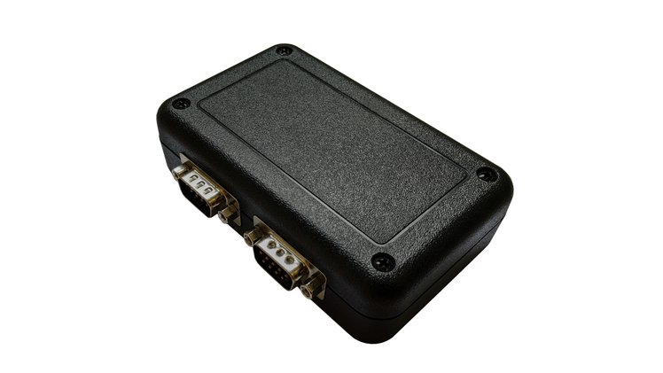
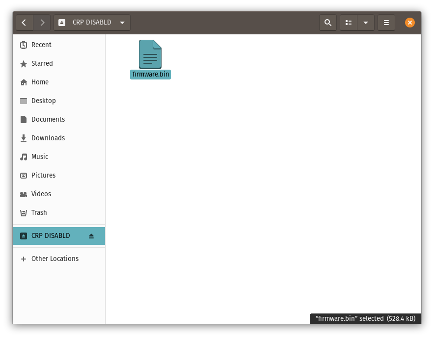

# CANtact Pro User Guide



CANtact Pro is [available from CrowdSupply](https://www.crowdsupply.com/linklayer-labs/cantact-pro)

## Getting Started

Thank you for buying a CANtact Pro 🙂

To start using CANtact, connect it via USB. Before using, you should update to the latest 
firmware following the instructions in this document.

After updating, the device will work on Linux via SocketCAN. For details, see [SocketCAN](../tools/socketcan.html). 

On all platforms, you can install the CANtact CLI. For details, see [CANtact CLI](../tools/cantact-cli.html).

For more information on software support, see [Software Tools](../tools/software-tools.html).

## Features & Specifications
- 2x CAN Interfaces
  - 1x CAN/CAN-FD/SWCAN
  - 1x CAN/CAN-FD
- High Speed USB interface (480 Mbit/s)
- Isolation between CAN and USB
- Industry standard DB9 connectors
- Software support for Windows, macOS, and Linux
  - Cross-platform USB driver, command line interface, and APIs:
    - Python (via [python-can](https://github.com/hardbyte/python-can/))
    - C / C++
    - Rust
  - [ETAS BUSMASTER](https://rbei-etas.github.io/busmaster/) support on Windows
  - SocketCAN support on Linux


## Pin Assignments

|Pin | Function | CAN 0 Only? |
|----|----------|-------------|
|1   |          |
|2   | CAN -    |
|3   | GND      |
|4   | SWCAN    | Yes
|5   |          |
|6   | GND      |
|7   | CAN +    |
|8   |          |
|9   | +12 V In | Yes

Note that single-wire CAN is only available on the CAN 0 connector.

## LED Indicators

The device has four LEDs, two for each CAN channel. When powered on, the LEDs will blink in sequence. The LED indications during normal operations are shown here.

|Color  | State   | Meaning |
|-------|---------|---------|
| Green | Solid   | channel enabled, no activity
| Green | Blinking| receive activity 
| Red   | Solid   | channel transmit enabled, no activity
| Red   | Blinking| transmit activity 

When using SocketCAN, each CAN interface can be identified by blinking the corresponding LEDs using `ethtool`. This is especially useful when using multiple devices.

```
sudo ethtool --identify can0
```

## Configuring Permissions on Linux

By default, root privileges are required to interact with the device. To allow other users to access the device, 
create a file at `/etc/udev/rules.d/99-cantact.rules`:
```
SUBSYSTEM=="usb", ATTRS{idVendor}=="1d50", ATTRS{idProduct}=="6070", MODE="0666"
```

After creating the file, reload the udev rules:
```
sudo udevadm control --reload-rules
sudo udevadm trigger
```

This will make the device accessible to all users. 

## Flashing Firmware

1. Download the newest firmware binary [from Github](https://github.com/linklayer/cantact-pro-fw/releases).
2. To enter bootloader mode, hold down the button beside the USB connector while connecting the device
to your computer.


The device will appear as a USB Mass Storage device with the label `CRP DISABLD`. Open the device. It should contain a single file: `firmware.bin`.



3. Delete the `firmware.bin` file from the device. 
4. Copy the downloaded `firmware.bin` file to the folder. 
5. Eject the device 
6. Unplug and reconnect the device. The firmware update is complete!