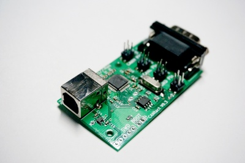
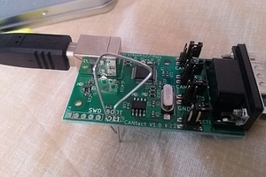

# CANtact



The CANtact device is a single channel USB CAN interface. It can be used to connect to CAN bus systems, including cars, heavy duty vehicles, and industrial automation systems. CANtact works on Linux, OS X, and Windows.

With a CANtact and an OBD-II to DE9 cable, it is very easy to get onto the OBD-II CAN bus of any CAN enabled vehicle. 

## Getting Started

### Connections & Jumpers

CANtact uses a USB-B cable to interface with your computer. These cables are commonly used to connect printers as well.

The DE9 connector of the CANtact allows for two pin mappings for different use cases:

- Pins 7 (CAN high), 2 (CAN low), and 3 (ground) for standard CAN connections
- Pins 3 (CAN high), 5 (CAN low), and 1 (ground) for use with an OBD-II to DB9 cable. This is compatible with the Sparkfun OBD-II cable.

The pins can be selected using the jumpers on board.

The final jumper is for CAN termination. Place the jumper beside the "CTE" marking to place 120 ohms across CAN high and CAN low. This is commonly used in development, when you are only interfacing with a single CAN device. 

### CandleLight Firmware
To use the tools discussed in this book, you **must ensure your CANtact is running the CandleLight firmware**. The firmware can be [downloaded from Github](https://github.com/linklayer/candleLight_fw/releases/download/cantact-8b2b2b4/gsusb_cantact_8b2b2b4.bin).

After downloading, follow the steps in [Updating Firmware](#updating-firmware) to perform the update.

## Updating Firmware

The CANtact can be updated over USB. First, you will need to put the device into DFU mode by following these steps: 

1.  Disconnect the USB cable from the CANtact
2. Connect the two "BOOT" pins



3. While the pins are connected, plug the USB cable into the CANtact
4. The CANtact device is now in DFU mode

The next steps depend on what OS you are using.

### Windows

1. Install the [ST DfuSe Tool](https://www.st.com/en/development-tools/stsw-stm32080.html)
2. Open the DfuSe tool
3. Click "Choose..." and select a DFU firmware file
4. Check the "Verify after download" box
5. Click Upgrade
6. Wait for the "Verify successful !" message at the bottom of the window.
7. Unplug the USB cable, disconnect the "BOOT" pins, and reconnect the USB cable. The device is now updated! 

### Linux & macOS

Flashing on Linux and macOS requires `dfu-util`.

On macOS, this can be installed from Brew: `brew install dfu-util`.

On Ubuntu, install dfu-util with: `sudo apt install dfu-util`.

Once `dfu-util` is installed, use it to flash the device:
```
sudo dfu-util --dfuse-address -d 0483:df11 -c 1 -i 0 -a 0 -s 0x08000000 -D FIRMWARE_FILE.bin
```

Once this is complete, unplug the USB cable, disconnect the "BOOT" pins, and reconnect the USB cable. The device is now updated! 